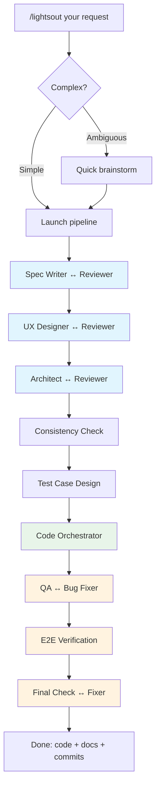

# claude-lights-out

[English](README.md) | [中文](README-zh.md)

**熄灯开发。一句话输入，生产级代码产出。**

[](LICENSE)

基于 [Claude Code dynamic workflow](https://docs.anthropic.com/en/docs/claude-code) 的全自动开发管道。给一句需求，交付可运行的、测试过的代码和持久化文档。

## 为什么

用 AI Agent 写代码（vibe coding）有四个未解决的问题：

| 问题 | 现状 | lights-out 怎么解 |
|------|------|------------------|
| **不可控** | Agent 跳过测试、忽略边界、偷工减料 | 固定 9 阶段管道，每阶段必跑，不可跳过 |
| **黑盒** | Agent 跑了 20 分钟，不知道到哪了 | Claude workflow board 实时显示阶段进度 |
| **耗费人脑** | 你测→找 bug→报→Agent 修→循环 | Agent 完成设计+测试+QA 全循环后才交付 |
| **上下文丢失** | 换 session 或 compact 后，Agent 忘了一切 | 强制维护文档（spec+design+arch），跨 session 持久 |

另外：**对抗性质量保证**——每个产物经过独立的 write → review → fix 循环。单个 Agent 不会找自己的 bug。

## 安装

```bash
curl -fsSL https://raw.githubusercontent.com/DreamChaserEric/claude-lights-out/main/install.sh | bash
```

需要：[Claude Code CLI](https://docs.anthropic.com/en/docs/claude-code)（支持 workflow 功能）。

## 使用

```
/lightsout Build a CLI that converts CSV to JSON with streaming support
/lightsout Add rate limiting to the existing API endpoints
/lightsout Fix: search returns stale results after cache invalidation
```

简单需求直接执行。模糊需求会快速 brainstorm（最多 3-5 个问题）。

## 执行流程



每阶段必跑。Agent 自校准深度——bug fix 时文档阶段秒过，greenfield 项目全面展开。Code Orchestrator 自主决定是单人实现还是拆分并行。

## 架构

**三层分离：**

| 层 | 职责 | 位置 |
|----|------|------|
| 编排层 | 阶段顺序、循环控制、状态累积 | `lightsout-workflow.js` |
| 角色层 | Agent 身份、能力、行为规则 | `prompts/*.md` |
| 情景层 | 为每个 agent 生成上下文摘要 | Supervisor agent |

**Supervisor** 读取完整管道状态 + worker 的角色定义，生成聚焦的 context brief。Worker 看到：角色指令 + supervisor 摘要 + 用户原始输入。

## 设计原则

- **写和审分离** — 独立 agent 审查，抓住作者看不到的问题
- **文档是 ground truth** — `spec.md`, `design.md`, `architecture.md` 跨 session 持久
- **职责清晰** — spec 管行为，design 管交互，arch 管技术结构
- **信息不丢失** — 模板是引导不是约束，agent 保留所有相关输入
- **优先级链** — 原始输入 > architecture > spec > 领域知识
- **先测试后代码** — 测试用例在实现前设计，驱动 TDD

## 产出

Pipeline 运行后，你的项目包含：

```
docs/
  spec.md           # 产品规格（能力、场景、错误处理）
  design.md         # 交互设计（UX 流程、状态、反馈）
  architecture.md   # 技术架构（ADR、结构、契约）
  test-cases.md     # 实现前设计的测试计划
src/                # 可运行的、测试过的代码
tests/              # 完整测试套件（先于代码编写）
```

这些文档是项目的记忆。下次 session，任何 agent 都能读取它们继续工作。

## 定制

编辑 `~/.claude/lights-out/prompts/` 下的任何 prompt：

```
supervisor.md          # 上下文合成规则
spec-writer.md         # 产品规格
ux-designer.md         # 交互设计
architect.md           # 技术架构
code-agent.md          # 编排器 + TDD 实现
test-case-designer.md  # 测试设计原则
qa-engineer.md         # 质量验证
visual-qa.md           # E2E 验证
+ reviewer/fixer prompts
```

## 限制

- 需要 Claude Code 且支持 workflow
- 每次运行 30-50 个 agent call，取决于项目复杂度
- 最适合中小型 greenfield 项目和明确范围的功能
- 不替代生产系统的人工 code review

## License

MIT
