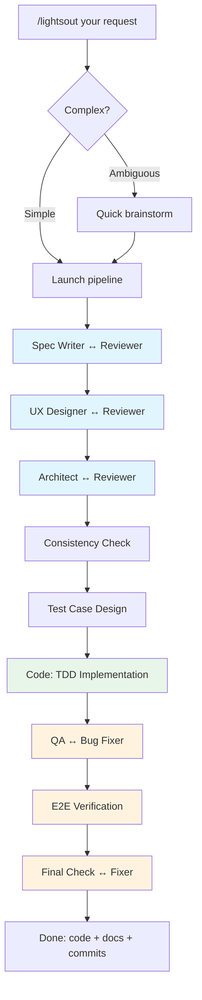

# claude-lights-out

[English](README.md) | [中文](README-zh.md)

**One sentence in, production code out.**

[](LICENSE)

A fully automated development pipeline for [Claude Code](https://docs.anthropic.com/en/docs/claude-code). Give it a requirement — it delivers production code with persistent documentation.

## Install

```bash
curl -fsSL https://raw.githubusercontent.com/DreamChaserEric/claude-lights-out/main/install.sh | bash
```

## Usage

```
/lightsout Build a CLI that converts CSV to JSON with streaming support
/lightsout Add rate limiting to the existing API endpoints
/lightsout Fix: search returns stale results after cache invalidation
```

## How It Works



Every phase runs. Agents self-calibrate depth — a bug fix breezes through docs ("no changes needed"), a greenfield project gets full treatment.

## Architecture

**Three-layer separation:**

| Layer | Responsibility | Where |
|-------|---------------|-------|
| Orchestration | Phase order, loop control, state accumulation | `lightsout-workflow.js` |
| Role | Agent identity, capabilities, behavior rules | `prompts/*.md` |
| Context | Situation-aware briefing for each agent | Supervisor agent |

The **supervisor** reads full pipeline state + the worker's role definition, then generates a focused context brief. Every worker agent sees: its role instructions + supervisor brief + original input.

## Design Principles

- **Writer ≠ Reviewer** — independent agents, no self-review blind spots
- **Docs are ground truth** — `spec.md`, `design.md`, `architecture.md` persist across sessions
- **Clear ownership** — spec owns behaviors, design owns interactions, arch owns technical structure
- **Information never lost** — templates are guides not constraints; agents preserve all relevant input
- **Priority chain** — original input > architecture > spec > domain knowledge
- **Test before code** — test cases designed before implementation, driving TDD

## Benchmark

Validated against [NL2Repo-Bench](https://github.com/multimodal-art-projection/NL2RepoBench) (ACM TOSEM, ByteDance/NJU/PKU):

| Task | Raw Opus 4.6 | Pipeline | Δ |
|------|-------------|----------|---|
| pyjwt (299 tests) | 70.6% | **97.0%** | +26.4% |
| tinydb (204 tests) | 92.2% | **94.6%** | +2.4% |
| python-dotenv (209 tests) | **87.6%** | 78.0% | -9.6% |
| aiofiles (211 tests) | 0.5% | **97.6%** | +97.1% |

Pipeline excels on complex projects where structured analysis prevents implementation errors.

## Customization

Edit any prompt file in `~/.claude/lights-out/prompts/`:

```
supervisor.md          # Context synthesis rules
spec-writer.md         # Product specification
ux-designer.md         # Interaction design
architect.md           # Technical architecture
code-agent.md          # TDD implementation
test-case-designer.md  # Test design principles
qa-engineer.md         # Quality verification
+ 6 reviewer/fixer prompts
```

## Requirements

- Claude Code CLI (with workflow support)
- git

## License

MIT
