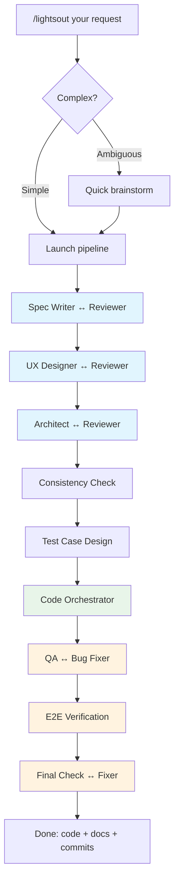

# claude-lights-out

[English](README.md) | [中文](README-zh.md)

**One sentence in, production code out.**

[](LICENSE)

A fully automated development pipeline for [Claude Code](https://docs.anthropic.com/en/docs/claude-code). Give it a requirement — it delivers working, tested code with persistent documentation.

## Why

Vibe coding with AI agents has four unsolved problems:

| Problem | What happens | How lights-out solves it |
|---------|-------------|------------------------|
| **No control** | Agent skips testing, ignores edge cases, cuts corners | Fixed 9-phase pipeline — every phase runs, no shortcuts |
| **Black box** | Agent runs for 20 minutes, you have no idea what's happening | Claude workflow board shows real-time phase progress |
| **Too much babysitting** | You test → find bug → report → agent fixes → repeat | Agent does full design + test + QA loop before delivery |
| **Context amnesia** | New session or compaction = agent forgets everything | Forced doc maintenance (spec + design + arch) survives across sessions |

Plus: **adversarial quality** — every artifact goes through independent write → review → fix cycles. A single agent won't find its own mistakes.

## Install

```bash
curl -fsSL https://raw.githubusercontent.com/DreamChaserEric/claude-lights-out/main/install.sh | bash
```

Requires: [Claude Code CLI](https://docs.anthropic.com/en/docs/claude-code) with workflow support.

## Usage

```
/lightsout Build a CLI that converts CSV to JSON with streaming support
/lightsout Add rate limiting to the existing API endpoints
/lightsout Fix: search returns stale results after cache invalidation
```

Simple requests launch immediately. Ambiguous requests get a quick brainstorm (3-5 questions max).

## How It Works



Every phase runs. Agents self-calibrate depth — a bug fix breezes through docs, a greenfield project gets full treatment. The code orchestrator autonomously decides whether to implement solo or spawn parallel sub-agents based on project complexity.

## Architecture

**Three-layer separation:**

| Layer | Responsibility | Where |
|-------|---------------|-------|
| Orchestration | Phase order, loop control, state accumulation | `lightsout-workflow.js` |
| Role | Agent identity, capabilities, behavior rules | `prompts/*.md` |
| Context | Situation-aware briefing for each agent | Supervisor agent |

The **supervisor** reads full pipeline state + the worker's role definition, then generates a focused context brief. Workers see: role instructions + supervisor brief + original user input.

## Design Principles

- **Writer ≠ Reviewer** — independent agents catch what the author can't see
- **Docs are ground truth** — `spec.md`, `design.md`, `architecture.md` persist across sessions
- **Clear ownership** — spec owns behaviors, design owns interactions, arch owns technical structure
- **Information never lost** — templates are guides not constraints; agents preserve all relevant input
- **Priority chain** — original input > architecture > spec > domain knowledge
- **Test before code** — test cases designed before implementation, driving TDD

## What You Get

After a pipeline run, your project contains:

```
docs/
  spec.md           # Product specification (capabilities, scenarios, errors)
  design.md         # Interaction design (UX flows, states, feedback)
  architecture.md   # Technical architecture (ADRs, structure, contracts)
  test-cases.md     # Test plan designed before implementation
src/                # Working, tested implementation
tests/              # Full test suite (written before code)
```

These docs are the project's memory. Next session, any agent can read them and continue without re-explanation.

## Customization

Edit any prompt in `~/.claude/lights-out/prompts/`:

```
supervisor.md          # Context synthesis rules
spec-writer.md         # Product specification
ux-designer.md         # Interaction design
architect.md           # Technical architecture
code-agent.md          # Orchestrator + TDD implementation
test-case-designer.md  # Test design principles
qa-engineer.md         # Quality verification
visual-qa.md           # E2E verification
+ reviewer/fixer prompts
```

## Limitations

- Requires Claude Code with workflow support
- Each run uses 30-50 agent calls depending on project complexity
- Best suited for small-to-medium greenfield projects and well-scoped features
- Not a replacement for human code review on production systems

## License

MIT
